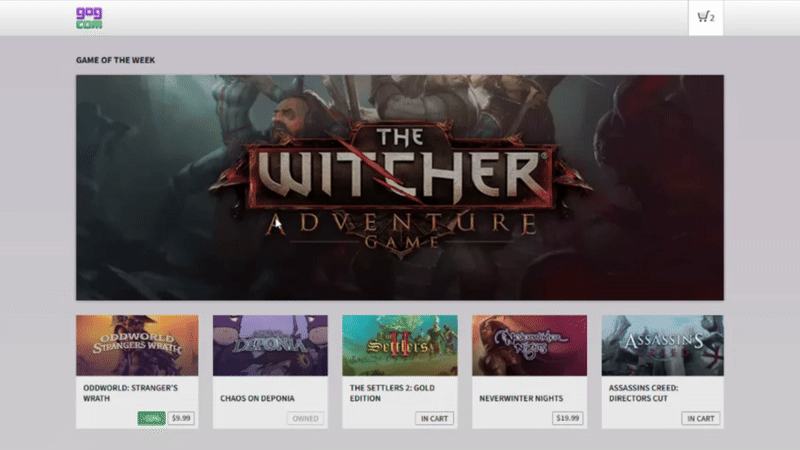

# GOG - Senior Product Engineer (Front-End) - Assignment

This is a sample shopping cart application built with Angular (v18) as part of a Senior Front End Developer assignment for GoG.  
It demonstrates modern Angular features, accessibility, state management, and a modular component structure.




## Table of Contents

- [Features](#features)
- [Getting Started](#getting-started)
- [Running the Application](#running-the-application)
- [Testing](#testing)
- [Project Structure](#project-structure)
- [Notes](#notes)
- [License](#license)
- [Author](#author)

## Features

- Modern Angular 18 with standalone components and signals
- Responsive design (Bootstrap 5)
- Modular state management (@ngrx/component-store)
- Mock API with json-server
- Unit tests for all major logic

## Getting Started

### Prerequisites

- [Node.js](https://nodejs.org/) (v18+ recommended)
- [npm](https://www.npmjs.com/) (comes with Node.js)
- [Angular CLI](https://angular.io/cli) (optional, for local development)

### Installation

1. **Clone the repository:**
    ```sh
    git clone https://github.com/leonardosr/gog-cart-assignment.git
    cd gog-cart-assignment
    ```

2. **Install dependencies:**
    ```sh
    npm install
    ```

3. **Install `json-server` globally (if not already):**
    ```sh
    npm install -g json-server
    ```

---

## Running the Application

### 1. Start the Mock API with `json-server`

- The app uses [json-server](https://github.com/typicode/json-server) to mock backend API calls.  
- A sample `_db.json` file is provided in the project root as a template.  
- Copy or rename it to `db.json` before starting the server.  
- If you need to restore the initial data, use `db_bkp.json`.

```sh
json-server --watch db.json --port 3000
```
or
```sh
npm run json-server
```

- The API will be available at `http://localhost:3000/`.
- You can edit `db.json` to change the product catalog or cart data.
- You can use the `db_bkp.json` file to restore the initial data.

### 2. Start the Angular Application

In a new terminal window/tab:

```sh
npm start
```
or
```sh
ng serve
```

- The app will be available at `http://localhost:4200/`.

---

## Testing

- Run all unit tests: `npm test`
- Coverage reports are generated in `/coverage`
- Tests cover components, pipes, store logic, and utility functions

## Project Structure

```
src/
  app/
    app.component.ts
    app.component.store.ts
  common-ui/
    catalog/
    featured/
    mini-cart/
    navbar/
  constants/
  interceptors/
  interfaces/
  pipes/
  services/
  utils/
  assets/
    styles/
      themes/
        gog-bootstrap-theme/
          overrides/
  db.json
```

---

## Notes

- The application uses Angular signals and standalone components (Angular 18).
- State management is handled with `@ngrx/component-store`.
- Styling uses Bootstrap 5 with custom theme overrides.
- The mock API (`json-server`) is required for full functionality.

---

## License

- This project is for assignment/demo purposes only.

---

## Author

- Leonardo Salomão dos Reis
- leo.salomao.reis@gmail.com
